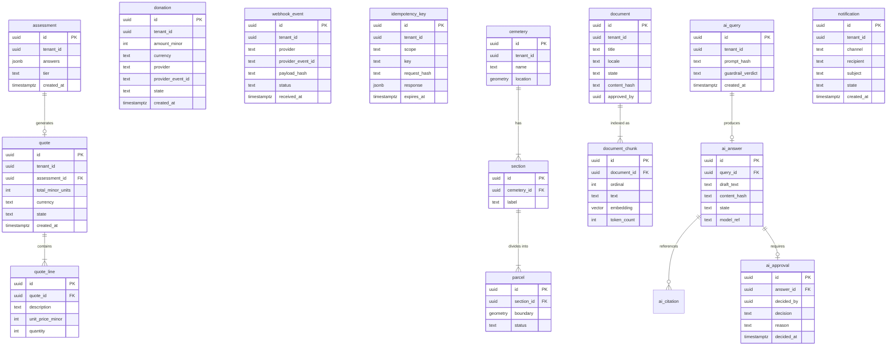

# Data model

> All tables live in a tenant-specific PostgreSQL schema (ADR-004). The
> application connects with `SET app.tenant_id` and row-level security
> policies ensure no cross-tenant reads or writes.

## Conventions

| Rule | Detail |
| --- | --- |
| Primary key | `UUID`, generated by `gen_random_uuid()` |
| Tenant column | `tenant_id UUID NOT NULL`, indexed, part of every RLS policy |
| Timestamps | `created_at` / `updated_at`, `DateTime(timezone=True)`, server-defaulted |
| Money | Integer minor units + `currency` code (e.g. `999` + `EUR` = €9.99) |
| Geometry | PostGIS `Geometry(Point, 4326)` for cemetery parcels |
| Embeddings | `vector(1024)` via pgvector for RAG chunks |
| Secrets | No column stores a secret or raw card data |

## Entity relationship overview



## Tenancy model

Every table carries `tenant_id`. Row-level security policies are created in
every Alembic migration (expand-contract, ADR-004). The middleware sets
`app.tenant_id` on the PostgreSQL session before any query; the RLS policy
filters all reads and writes:

```sql
CREATE POLICY tenant_isolation ON <table>
    USING (tenant_id = current_setting('app.tenant_id')::uuid);
```

Queries without a tenant context are rejected by the repository helpers
(`app/core/tenancy.py`).

## Idempotency ledger (ADR-005)

Two tables back the idempotency surface:

- **`webhook_event`** — stores every verified provider event by
  `(provider, provider_event_id)` with a unique constraint. A replayed
  delivery returns the stored result instead of re-running side effects.
- **`idempotency_key`** — stores client-supplied `Idempotency-Key` headers
  for money-moving endpoints. Keys expire after 30 days. A replayed key with
  a different `request_hash` returns `409 Conflict`.

## AI / RAG tables (DPIA-002)

- **`document`** — source documents in the tenant's approved corpus. Only
  documents in `approved` state are indexed.
- **`document_chunk`** — text chunks with pgvector embeddings. Screened at
  ingest so no personal data is stored.
- **`ai_query`** — the prompt hash and guardrail verdict. Prompt text is not
  stored verbatim when it may carry personal data.
- **`ai_answer`** — the generated draft, content hash, and state machine
  (`draft` → `pending_review` → `approved` / `rejected`).
- **`ai_approval`** — append-only audit trail. The approver must differ from
  the author (enforced in `app/services/approvals.py`).
